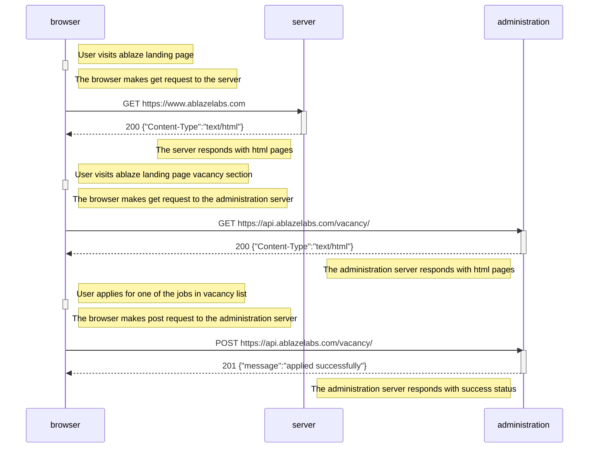

# Ablaze Company Landing Page

_Welcome to Ablaze, your go-to source for innovative solutions! This repository contains the code for our company's landing page._

> [Technologies Used](#technologies-used) > [Getting Started](#getting-started) > [Code Quality and Formatting](#code-quality-and-formatting) > [Coding Guidelines](#coding-guidelines) > [File Structure](#file-structure) > [Application Architecture](#application-architecture) > [License](#license)

## Technologies Used

- Vite
- React
- React Router
- Tailwind css
- ESLint
- Prettier
- Husky
- Commitlint
- Framer Motion
- React Query
- Signal
- JSDoc

## Getting Started

### Prerequisites

Make sure you have Node.js and NPM installed on your local machine

### Installation

1. Clone the repository:

```bash
git clone https://github.com/Ablazelab/ablaze-landing.git
cd ablaze-landing
```

2. Install dependencies:

```bash
npm install
```

### Development

To start the development server, run:

```bash
npm run dev
```

This will start the development server and open the app in your default browser. You can start editing the source files in the `src` directory, and the changes will be hot-reloaded.

### Build

To build the project for production, run:

```bash
npm run build
```

The optimized and minified files will be created in the `dist` directory.

## Code Quality and Formatting

- ESLint is used for code linting to maintain consistent coding styles.
- Prettier is used for code formatting to ensure a uniform code format.
- These tools are integrated with Husky to run pre-commit checks, ensuring clean and well-formatted code.

## Coding Guidelines

- We use tabs, not spaces.

### Names

- Use PascalCase for `type` names
- Use PascalCase for `enum` values
- Use camelCase for `function` and `method` names
- Use camelCase for `property` names and `local variables`
- Use whole words in names when possible

### Types

- Do not export `types` or `functions` unless you need to share it across multiple components
- Do not introduce new `types` or `values` to the global namespace

### Comments

- Use JSDoc style comments for `functions`, `interfaces`, `enums`, and `classes`

### Strings

- Use "double quotes" for strings shown to the user that need to be externalized (localized)
- Use 'single quotes' otherwise
- All strings visible to the user need to be externalized

### Style

- Use arrow functions `=>` over anonymous function expressions

## File Structure

```
├── index.html
├── commitlint.config.cjs
├── postcss.config.js
├── tailwind.config.js
├── tsconfig.json
├── tsconfig.node.json
├── vite.config.ts
├── package.json
├── package-lock.json
├── README.md
└── src
    ├── App.tsx
    ├── index.tsx
    ├── index.css
    ├── main.ts
    ├── assets/
    ├── constants/
    ├── context/
    ├── hooks/
    ├── layouts/
    ├── pages/
    ├── utils/
    ├── services/
    └── components/
        ├── form/
        └── ui/
            ├── __test__/
            └── __types__/
```

## Application Architecture



_Documented by Ablaze Developers_

##

```


                                ,---,                   ,--,
                               '  .' \        ,---,   ,--.'|
                              /  ;    '.    ,---.'|   |  | :                      ,----,
                             :  :       \   |   | :   :  : '                    .'   .`|
                             :  |   /\   \  :   : :   |  ' |     ,--.--.     .'   .'  .'   ,---.
                             |  :  ' ;.   : :     |,-.'  | |    /       \  ,---, '   ./   /     \
                             |  |  ;/  \   \|   : '  ||  | :   .--.  .-. | ;   | .'  /   /    /  |
                             '  :  | \  \ ,'|   |  / :'  : |__  \__\/: . . `---' /  ;--,.    ' / |
                             |  |  '  '--'  '   : |: ||  | '.'| ," .--.; |   /  /  / .`|'   ;   /|
                             |  :  :        |   | '/ :;  :    ;/  /  ,.  | ./__;     .' '   |  / |
                             |  | ,'        |   :    ||  ,   /;  :   .'   \;   |  .'    |   :    |
                             `--''          /    \  /  ---`-' |  ,     .-./`---'         \   \  /
                                            `-'----'           `--`---'                   `----'
```
