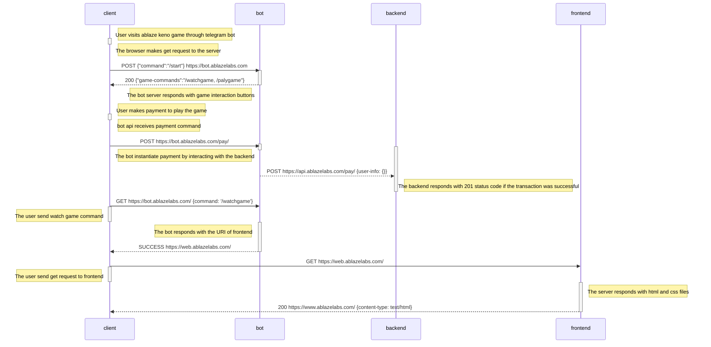

```
      ___           ___           ___           ___                    ___           ___           ___           ___
     /|  |         /\__\         /\  \         /\  \                  /\__\         /\  \         /\  \         /\__\
    |:|  |        /:/ _/_        \:\  \       /::\  \                /:/ _/_       /::\  \       |::\  \       /:/ _/_
    |:|  |       /:/ /\__\        \:\  \     /:/\:\  \              /:/ /\  \     /:/\:\  \      |:|:\  \     /:/ /\__\
  __|:|  |      /:/ /:/ _/_   _____\:\  \   /:/  \:\  \            /:/ /::\  \   /:/ /::\  \   __|:|\:\  \   /:/ /:/ _/_
 /\ |:|__|____ /:/_/:/ /\__\ /::::::::\__\ /:/__/ \:\__\          /:/__\/\:\__\ /:/_/:/\:\__\ /::::|_\:\__\ /:/_/:/ /\__\
 \:\/:::::/__/ \:\/:/ /:/  / \:\~~\~~\/__/ \:\  \ /:/  /          \:\  \ /:/  / \:\/:/  \/__/ \:\~~\  \/__/ \:\/:/ /:/  /
  \::/~~/~      \::/_/:/  /   \:\  \        \:\  /:/  /            \:\  /:/  /   \::/__/       \:\  \        \::/_/:/  /
   \:\~~\        \:\/:/  /     \:\  \        \:\/:/  /              \:\/:/  /     \:\  \        \:\  \        \:\/:/  /
    \:\__\        \::/  /       \:\__\        \::/  /                \::/  /       \:\__\        \:\__\        \::/  /
     \/__/         \/__/         \/__/         \/__/                  \/__/         \/__/         \/__/         \/__/
```

_This repository contains the code for keno telegram bot game._

## Technologies Used

- Vite
- React
- MATTER-JS
- Tailwind css
- ESLint
- Prettier
- Husky
- Commitlint
- Signal
- SOCKET.IO

## Getting Started

### Prerequisites

Make sure you have Node.js and NPM installed on your local machine

### Installation

1. Clone the repository:

```bash
git clone https://github.com/Ablazelab/keno-bot-frontend.git
cd ablaze-landing
```

2. Install dependencies:

```bash
npm install
```

### Development

To start the development server, run:

```bash
npm run dev
```

This will start the development server and open the app in your default browser. You can start editing the source files in the `src` directory, and the changes will be hot-reloaded.

### Build

To build the project for production, run:

```bash
npm run build
```

The optimized and minified files will be created in the `dist` directory.

## Code Quality and Formatting

- ESLint is used for code linting to maintain consistent coding styles.
- Prettier is used for code formatting to ensure a uniform code format.
- These tools are integrated with Husky to run pre-commit checks, ensuring clean and well-formatted code.

## Coding Guidelines

- We use tabs, not spaces.

### Names

- Use PascalCase for `type` names
- Use PascalCase for `enum` values
- Use camelCase for `function` and `method` names
- Use camelCase for `property` names and `local variables`
- Use whole words in names when possible

### Types

- Do not export `types` or `functions` unless you need to share it across multiple components
- Do not introduce new `types` or `values` to the global namespace

### Comments

- Use JSDoc style comments for `functions`, `interfaces`, `enums`, and `classes`

### Strings

- Use "double quotes" for strings shown to the user that need to be externalized (localized)
- Use 'single quotes' otherwise
- All strings visible to the user need to be externalized

### Style

- Use arrow functions `=>` over anonymous function expressions

## File Structure

```
├── commitlint.config.cjs
├── dist
│   ├── assets
│   │   ├── balls
│   │   │   ├── glass_container.png
│   │   │   ├── glass_container.webp
│   │   │   └── todo.txt
│   │   ├── fonts
│   │   │   ├── eurasia.ttf
│   │   │   ├── goodtime.ttf
│   │   │   ├── moire-extrabold.woff
│   │   │   ├── waukegan ldo black.ttf
│   │   │   └── waukegan ldo bold.ttf
│   │   ├── Frame.png
│   │   ├── history.png
│   │   ├── images
│   │   │   ├── logo.svg
│   │   │   ├── marathon-bet.svg
│   │   │   └── splash.svg
│   │   ├── index-68ef6dfb.css
│   │   ├── index-7b3842a3.js
│   │   ├── keno_logo.png
│   │   ├── kenologo.png
│   │   ├── logo.svg
│   │   ├── marathon-logo.png
│   │   ├── poster-dd7d7369.png
│   │   ├── react.svg
│   │   ├── Screenshot from 2023-08-10 16-40-45.png
│   │   └── upcomingevents.png
│   ├── index.html
│   ├── locales
│   │   ├── am
│   │   │   └── translation.json
│   │   └── en
│   │       └── translation.json
│   └── vite.svg
├── index.html
├── package.json
├── package-lock.json
├── postcss.config.js
├── public
│   ├── assets
│   │   ├── balls
│   │   │   ├── glass_container.png
│   │   │   ├── glass_container.webp
│   │   │   └── todo.txt
│   │   ├── fonts
│   │   │   ├── eurasia.ttf
│   │   │   ├── goodtime.ttf
│   │   │   ├── moire-extrabold.woff
│   │   │   ├── waukegan ldo black.ttf
│   │   │   └── waukegan ldo bold.ttf
│   │   ├── Frame.png
│   │   ├── history.png
│   │   ├── images
│   │   │   ├── logo.svg
│   │   │   ├── marathon-bet.svg
│   │   │   └── splash.svg
│   │   ├── keno_logo.png
│   │   ├── kenologo.png
│   │   ├── logo.svg
│   │   ├── marathon-logo.png
│   │   ├── react.svg
│   │   ├── Screenshot from 2023-08-10 16-40-45.png
│   │   └── upcomingevents.png
│   ├── locales
│   │   ├── am
│   │   │   └── translation.json
│   │   └── en
│   │       └── translation.json
│   └── vite.svg
├── README.md
├── src
│   ├── App.tsx
│   ├── assets
│   │   ├── balls
│   │   │   ├── 59.png
│   │   │   ├── 7.png
│   │   │   └── todo.txt
│   │   ├── fonts
│   │   │   ├── eurasia.ttf
│   │   │   ├── goodtime.ttf
│   │   │   ├── moire-extrabold.woff
│   │   │   ├── waukegan ldo black.ttf
│   │   │   └── waukegan ldo bold.ttf
│   │   ├── Frame.png
│   │   ├── history.png
│   │   ├── images
│   │   │   ├── logo.svg
│   │   │   ├── marathon-bet.svg
│   │   │   └── splash.svg
│   │   ├── keno_logo.png
│   │   ├── kenologo.png
│   │   ├── loader.png
│   │   ├── marathon-logo.png
│   │   ├── poster.png
│   │   └── react.svg
│   ├── components
│   │   ├── BlowAniumation
│   │   │   ├── animation.tsx
│   │   │   └── index.tsx
│   │   ├── ErrorPage
│   │   │   └── index.tsx
│   │   ├── Game
│   │   │   ├── GameBGPattern.tsx
│   │   │   ├── GameDisplayLeft
│   │   │   │   ├── GameBoard.tsx
│   │   │   │   ├── GameFooter.tsx
│   │   │   │   ├── GameTitle.tsx
│   │   │   │   └── index.tsx
│   │   │   ├── GameDisplayRight
│   │   │   │   ├── DisplayBallDrawn.tsx
│   │   │   │   ├── DisplayHitWin.tsx
│   │   │   │   ├── GameDisplayLive.tsx
│   │   │   │   ├── GameDisplayStatTimer.tsx
│   │   │   │   ├── GameDisplayStat.tsx
│   │   │   │   ├── HitWin.tsx
│   │   │   │   ├── index.tsx
│   │   │   │   └── JackpotTImer.tsx
│   │   │   ├── GameDisplay.tsx
│   │   │   ├── GameHeaderLogo.tsx
│   │   │   └── GameHeader.tsx
│   │   ├── History
│   │   │   ├── HistoryCard.tsx
│   │   │   └── index.tsx
│   │   ├── Jackpot
│   │   │   └── index.tsx
│   │   └── Jumbotron
│   │       └── index.tsx
│   ├── constants
│   │   └── __test__
│   ├── context
│   │   ├── AuthContext.tsx
│   │   └── __test__
│   ├── hooks
│   │   ├── __test__
│   │   └── UseAuth.tsx
│   ├── i18n.ts
│   ├── index.css
│   ├── layouts
│   │   ├── GameLayout
│   │   │   └── index.tsx
│   │   ├── RootLayout
│   │   │   └── index.tsx
│   │   ├── __test__
│   │   └── UpcomingEventsLayout
│   │       └── index.tsx
│   ├── main.tsx
│   ├── pages
│   │   ├── BlowAnimation
│   │   │   └── index.tsx
│   │   ├── Game
│   │   │   └── index.tsx
│   │   ├── History
│   │   │   └── index.tsx
│   │   ├── Home
│   │   │   └── index.tsx
│   │   └── UpcomingEvents
│   │       └── index.tsx
│   ├── services
│   │   ├── gameService.ts
│   │   ├── routeService.ts
│   │   └── timeCounterService.ts
│   ├── types
│   │   └── index.d.ts
│   ├── utils
│   │   ├── displayGameSignal.ts
│   │   ├── displayRightSignal.ts
│   │   ├── formateDate.ts
│   │   └── __test__
│   └── vite-env.d.ts
├── tailwind.config.js
├── tsconfig.json
├── tsconfig.node.json
└── vite.config.ts

```
## Application Architecture



_Documented by Ablaze Developers_

##

```


                                ,---,                   ,--,
                               '  .' \        ,---,   ,--.'|
                              /  ;    '.    ,---.'|   |  | :                      ,----,
                             :  :       \   |   | :   :  : '                    .'   .`|
                             :  |   /\   \  :   : :   |  ' |     ,--.--.     .'   .'  .'   ,---.
                             |  :  ' ;.   : :     |,-.'  | |    /       \  ,---, '   ./   /     \
                             |  |  ;/  \   \|   : '  ||  | :   .--.  .-. | ;   | .'  /   /    /  |
                             '  :  | \  \ ,'|   |  / :'  : |__  \__\/: . . `---' /  ;--,.    ' / |
                             |  |  '  '--'  '   : |: ||  | '.'| ," .--.; |   /  /  / .`|'   ;   /|
                             |  :  :        |   | '/ :;  :    ;/  /  ,.  | ./__;     .' '   |  / |
                             |  | ,'        |   :    ||  ,   /;  :   .'   \;   |  .'    |   :    |
                             `--''          /    \  /  ---`-' |  ,     .-./`---'         \   \  /
                                            `-'----'           `--`---'                   `----'
```
